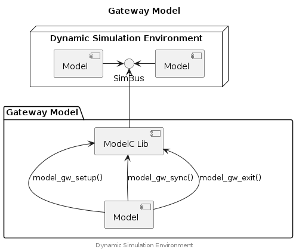

## Gateway Model


When implemented, a Gateway Model makes it possible for a foreign Simulation
Environment to connect with a Dynamic Simulation Environment. The two
simulation environments can then exchange signals and maintain synchronisation.

### Component Diagram

<div hidden>

```
@startuml gateway-model

title Gateway Model

node "Dynamic Simulation Environment" {
	component "Model" as m1
	component "Model" as m2
	interface "SimBus" as SBif
	m1 -left-> SBif
	m2 -right-> SBif
}
package "Gateway Model" {
	component "ModelC Lib" as ModelC
	component "Model"
}

SBif <-down- ModelC
Model -up-> ModelC :model_gw_setup()
Model -up-> ModelC :model_gw_sync()
Model -up-> ModelC :model_gw_exit()

center footer Dynamic Simulation Environment

@enduml
```

</div>




### Example





## Typedefs

### ModelGatewayDesc

```c
typedef struct ModelGatewayDesc {
    int* sim;
    int* mi;
    int* sv;
    const char** argv;
    char* name_arg;
}
```

## Functions

### model_gw_exit

Terminates the Gateway Model and releases all objects referenced by the
ModelGatewayDesc object. The object itself is not affected and should be
released by the caller (if necessary).

#### Parameters

gw (ModelGatewayDesc*)
: A gateway descriptor object, holds references to various ModelC objects.

#### Returns

0
: Success.

+ve
: Failure, inspect errno for the failing condition.


### model_gw_setup

#### Parameters

gw (ModelGatewayDesc*)
: A gateway descriptor object, holds references to various ModelC objects.

name (const char*)
: Name of the gateway model. Used when parsing the provided YAML files to
  select the relevant configuration items (i.e. Model and SignalGroup schemas).

yaml_files (const char*)
: A list of YAML files where the relevant gateway configuration objects
  should be found.

log_level (int)
: The log level to apply to the gateway model. Common values include;
  LOG_NOTICE (default), LOG_INFO, LOG_QUIET (only errors) or LOG_DEBUG.
  Set to a negative number to use the default log level.

step_size (double)
: Step size for interactions with the Simbus.

end_time (double)
: End time for the simulation (acts as guard against "forever" simulations).

#### Returns

0
: Success.

+ve
: Failure, inspect errno for the failing condition.


### model_gw_sync

#### Parameters

gw (ModelGatewayDesc*)
: A gateway descriptor object, holds references to various ModelC objects.

model_time (double)
: The current simulation time of the gateway model for which the
  Gateway API should synchronise with.

#### Returns

0
: Success.

E_GATEWAYBEHIND
: The specified model_time is _behind_ the simulation time. The time should be
  advanced by the caller and then retry this call until the condition clears.

+ve
: Failure, inspect errno for the failing condition.


