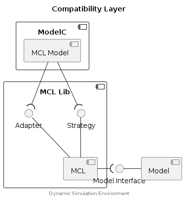

## Model Compatibility Layer


The Model Compatibility Layer (MCL) can be used to implement support for models
which were written according to different a modeling interface. This is done
by combining a Strategy and Adapter pattern to build an MCL which can load,
execute and exchange data with a the foreign model.


### Component Diagram

<div hidden>

```
@startuml mcl-component

title Compatibility Layer

component "ModelC" {
	component "MCL Model" as MCLmodel
}
component "MCL Lib" {
  interface "Strategy" as Sif
  interface "Adapter" as Aif
  component "MCL" as MCL
}
interface "Model Interface" as Mif
component "Model" as Model

MCLmodel --( Sif
MCLmodel --( Aif
Sif -- MCL
Aif -- MCL
MCL -( Mif
Mif - Model


center footer Dynamic Simulation Environment

@enduml
```

</div>




## Typedefs

### MclAdapterDesc

```c
typedef struct MclAdapterDesc {
    const char * name;
    MclLoadHandler load_func;
    MclInitHandler init_func;
    MclStepHandler step_func;
    MclUnloadHandler unload_func;
}
```

### MclInstanceDesc

```c
typedef struct MclInstanceDesc {
    int * model_instance;
    int * channel;
    MclStrategyDesc * strategy;
    int models;
}
```

### MclModelDesc

```c
typedef struct MclModelDesc {
    const char * name;
    int * model_doc;
    char * path;
    void * handle;
    double * vector_double;
    void ** vector_binary;
    double model_time;
    double model_time_correction;
    double step_size;
    MclAdapterDesc * adapter;
    void * private;
}
```

### MclStrategyDesc

```c
typedef struct MclStrategyDesc {
    const char * name;
    double model_time;
    double stop_time;
    MclExecuteMethod execute;
    MclExecuteHandler execute_func;
    MclMarshallOutHandler marshall_out_func;
    MclMarshallInHandler marshall_in_func;
    MclInstanceDesc * mcl_instance;
}
```

## Functions

### mcl_create

Creates an instance of an MCL Model. All configured Model Libraries (of the
MCL Model) are first associated with an MCL Adapter and MCL Strategy (provided
by an MCL Library) and then loaded via the MCL Adapter `load_func()`.

#### Parameters

model_instance (ModelInstanceSpec*)
: Model Instance object representing the Model. Contains various identifying
  and configuration elements.

#### Returns

0
: The MCL library way successfully loaded.

#### Exceptions

exit(errno)
: Any error in creating an MCL Model instance represents a fatal configuration
  error and `exit()` is called to terminate execution.


### mcl_destroy

Destroy an instance of an MCL Model, releasing any allocated memory or other
resources allocated to the MCL Model instance.

#### Parameters

model_instance (ModelInstanceSpec*)
: Model Instance object representing the Model. Contains various identifying
  and configuration elements.


### mcl_load

Loads an MCL Library which will contain a number of Strategy and/or Adapter
methods. The MCL Library should implement function `mcl_setup()` which will
be called by the MCL when the MCL Libary is loaded. The function `mcl_setup()`
of the MCL Library should call MCL functions `mcl_register_strategy()` and/or
`mcl_register_adapter()` to register _this_ MCL Library with the MCL.

#### Parameters

model_instance (ModelInstanceSpec*)
: Model Instance object representing the Model. Contains various identifying
  and configuration elements.

#### Returns

0
: The MCL library way successfully loaded.

#### Exceptions

exit(errno)
: Any error in loading an MCL represents a fatal configuration error and
  `exit()` is called to terminate execution.


### mcl_register_adapter

An MCL Library calls this function to register a particular MCL Adapter with
the MCL.

#### Parameters

adapter (MclAdapterDesc*)
: MCL Strategy object representing a strategy capability of the MCL Library.


### mcl_register_strategy

An MCL Library calls this function to register a particular MCL Strategy with
the MCL.

#### Parameters

strategy (MclStrategyDesc*)
: MCL Strategy object representing a strategy capability of the MCL Library.


