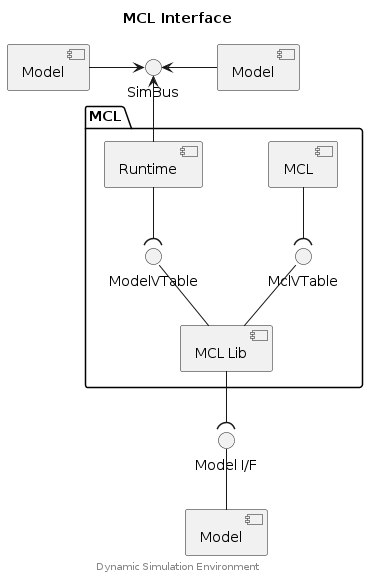

## Model Compatibility Library API


A Model Compatibility Library provides an interface for supporting 3rd-party
model interfaces in a DSE Simulation.


### Component Diagram

<div hidden>

```
@startuml mcl-interface

skinparam nodesep 55
skinparam ranksep 40

title MCL Interface

component "Model" as m1
component "Model" as m2
interface "SimBus" as SBif
m1 -left-> SBif
m2 -right-> SBif


package "MCL" {
        component "Runtime" as ModelC
        component "MCL" as Mcl
        interface "ModelVTable" as MVt
        interface "MclVTable" as MclVt
        component "MCL Lib" as MclLib
}


MclLib -up- MclVt
MclLib -up- MVt

SBif <-down- ModelC
MVt )-up- ModelC
MclVt )-up- Mcl

component "Model" as MclModel
interface "Model I/F" as ModelIf
MclModel -up- ModelIf
ModelIf )-up- MclLib

center footer Dynamic Simulation Environment

@enduml
```

</div>




## Typedefs

### MclDesc

```c
typedef struct MclDesc {
    int model;
    const char* adapter;
    const char* version;
    MclVTable vtable;
    double step_size;
    double model_time;
    double model_time_correction;
    struct {
        int count;
        const char** signal;
        struct {
            double* scalar;
            void** binary;
        } binary_len;
        int* kind;
    } source;
    int* msm;
    uint64_t [4] __reserved__;
}
```

### MclVTable

```c
typedef struct MclVTable {
    MclLoad load;
    MclInit init;
    MclStep step;
    MclMarshalOut marshal_out;
    MclMarshalIn marshal_in;
    MclUnload unload;
    void *[2] __reserved__;
}
```

## Functions

### mcl_create

Create an instance of the MCL which will then be used to operate the Model that
the MCL represents.

> Implemented by MCL.

#### Parameters

model (ModelDesc*)
: Model descriptor object.

#### Returns

MclDesc (pointer)
: Object representing the MCL Model, an extended ModelDesc type (derived from
parameter `model`).

NULL
: The MCL Model could not be created. Inspect `errno` for more details.

#### Error Conditions


Available by inspection of `errno`.


### mcl_destroy

Releases memory and system resources allocated by `mcl_create()`.

> Implemented by MCL.

#### Parameters

model (ModelDesc*)
: Model descriptor object.


### mcl_init

This method calls the MCL `init()` method which initialises the Model being
represented by this MCL instance.

#### Parameters

model (MclDesc*)
: The MCL Descriptor object representing an instance of the MCL Model.

#### Returns

0 (int32_t)
: The represented model was initialised by the MCL.

-EINVAL (-22)
: Bad `model` argument.


### mcl_load

This method calls the MCL `load()` method which in turn loads the Model being
represented by this MCL instance.

#### Parameters

model (MclDesc*)
: The MCL Descriptor object representing an instance of the MCL Model.

#### Returns

0 (int32_t)
: The related model was loaded by the MCL.

-EINVAL (-22)
: Bad `model` argument.


### mcl_marshal_in

This method calls the MCL `marshal_in()` method which in turn marshals
signals inwards, from the Model represented by this MCL instance.

#### Parameters

model (MclDesc*)
: The MCL Descriptor object representing an instance of the MCL Model.

#### Returns

0 (int32_t)
: Signals were marshalled inwards from the Model represented by the MCL.

-EINVAL (-22)
: Bad `model` argument.


### mcl_marshal_out

This method calls the MCL `marshal_out()` method which in turn marshals
signals outwards, towards the Model represented by this MCL instance.

#### Parameters

model (MclDesc*)
: The MCL Descriptor object representing an instance of the MCL Model.

#### Returns

0 (int32_t)
: Signals were marshalled outwards to the Model represented by the MCL.

-EINVAL (-22)
: Bad `model` argument.


### mcl_step

This method calls the MCL `step()` method to advance the Model represented by
this MCL instance to the simulation time specifed by the parameter `end_time`.

#### Parameters

model (MclDesc*)
: The MCL Descriptor object representing an instance of the MCL Model.

#### Returns

0 (int32_t)
: The represented model was stepped by the MCL to the specified `end_time`.

-1
: The model time is advanced beyond the current simulation time.

-EINVAL (-22)
: Bad `model` argument.


### mcl_unload

This method calls the MCL `unload()` method which unloads the Model
represented by this MCL instance.

#### Parameters

model (MclDesc*)
: The MCL Descriptor object representing an instance of the MCL Model.

#### Returns

0 (int32_t)
: The represented model was unloaded by the MCL.

-EINVAL (-22)
: Bad `model` argument.


