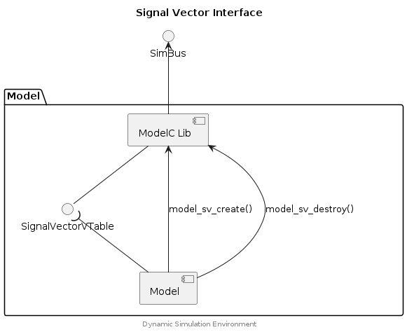

## Model API


The Model API allows model developers and integrators to interface with a
Dynamic Simulation Environment via a connection with a Simulation Bus.


## Signal Vector Interface


Models exchange signals via the Simulation Bus using a Signal Vector. Signal
Vectors represent a logical grouping of signals (i.e. a collection of signals
belonging to an ECU interface or bus), they are defined by a `SignalGroup`
schema kind, and a Signal Vector can represent either scalar or binary values.


### Component Diagram

<div hidden>

```
@startuml model-signal-vector

title Signal Vector Interface

interface "SimBus" as SBif

package "Model" {
	component "ModelC Lib" as ModelC
	interface "SignalVectorVTable" as SVvt
	component "Model" as Mdl
}

ModelC -up-> SBif
Mdl -up-( SVvt
SVvt -up- ModelC
Mdl --> ModelC :model_sv_create()
Mdl --> ModelC :model_sv_destroy()

center footer Dynamic Simulation Environment

@enduml
```

</div>




### Example





## Model Interface


The Model Interface must be implemented by a Model. It includes the functions
necessary for a Model to be loaded and executed in the Dynamic Simulation
Environment.


### Component Diagram

<div hidden>

```
@startuml model-interface

skinparam nodesep 55
skinparam ranksep 40

title Model Interface

component "Model" as m1
component "Model" as m2
interface "SimBus" as SBif
m1 -left-> SBif
m2 -right-> SBif

package "Model" {
	component "ModelC Lib" as ModelC
	interface "ModelInterfaceVTable" as MIvt
	component "Model" as Mdl
}

SBif <-down- ModelC
Mdl -up- MIvt
MIvt )-up- ModelC

center footer Dynamic Simulation Environment

@enduml
```

</div>


### Example





## Typedefs

### ChannelSpec

```c
typedef struct ChannelSpec {
    const char * name;
    const char * alias;
    void * private;
}
```

### ModelCArguments

```c
typedef struct ModelCArguments {
    const char * transport;
    char * uri;
    const char * host;
    uint32_t port;
    double timeout;
    uint8_t log_level;
    double step_size;
    double end_time;
    uint32_t uid;
    const char * name;
    const char * file;
    const char * path;
    int * yaml_doc_list;
    int timeout_set_by_cli;
    int log_level_set_by_cli;
    uint32_t steps;
}
```

### ModelChannelDesc

```c
typedef struct ModelChannelDesc {
    const char * name;
    const char * function_name;
    const char ** signal_names;
    uint32_t signal_count;
    bool propagator_source_channel;
    bool propagator_target_channel;
    double * vector_double;
    void ** vector_binary;
    uint32_t * vector_binary_size;
    uint32_t * vector_binary_buffer_size;
}
```

### ModelDefinitionSpec

```c
typedef struct ModelDefinitionSpec {
    const char * name;
    const char * path;
    const char * file;
    char * full_path;
    int * doc;
    int * channels;
}
```

### ModelInstanceSpec

```c
typedef struct ModelInstanceSpec {
    uint32_t uid;
    char * name;
    ModelDefinitionSpec model_definition;
    int * spec;
    int * propagators;
    int * yaml_doc_list;
    void * private;
}
```

### ModelInterfaceVTable

```c
typedef struct ModelInterfaceVTable {
    ModelSetupHandler setup;
    ModelDoStepHandler step;
    ModelExitHandler exit;
}
```

### SignalVector

```c
typedef struct SignalVector {
    const char * name;
    const char * alias;
    const char * function_name;
    bool is_binary;
    uint32_t count;
    const char ** signal;
    BinarySignalAppendFunc append;
    BinarySignalResetFunc reset;
    BinarySignalReleaseFunc release;
    SignalAnnotationGetFunc annotation;
    ModelInstanceSpec * mi;
}
```

### SignalVectorVTable

```c
typedef struct SignalVectorVTable {
    BinarySignalAppendFunc append;
    BinarySignalResetFunc reset;
    BinarySignalReleaseFunc release;
    SignalAnnotationGetFunc annotation;
}
```

### SimulationSpec

```c
typedef struct SimulationSpec {
    const char * transport;
    char * uri;
    uint32_t uid;
    double timeout;
    double step_size;
    double end_time;
    ModelInstanceSpec * instance_list;
}
```

## Functions

### model_configure_channel

Configure a connection from this Model to a Channel on the Simulation Bus. The
Channel can then be represented by a Signal Vector making access to individual
Signals and their configuration (annotations) easy.

#### Parameters

model_instance (ModelInstanceSpec*)
: The Model Instance object (provided via the `model_setup()` function of the
  Model API).

channel_desc (ModelChannelDesc*)
: A channel descriptor object which defines the Channel and Model Function names
  which should be configured.

#### Returns

0
: The Channel was configured.

+VE
: An error occurred during the registration of the Channel.


### model_function_register

Register a Model Function. A Model may register one or more Model Functions
with repeated calls to this function.

#### Parameters

model_instance (ModelInstanceSpec*)
: The Model Instance object (provided via the `model_setup()` function of the
  Model API).

name (const char*)
: The name of the Model Function.

step_size (double)
: The step size of the Model Function.

do_step_handler (ModelDoStepHandler)
: The "do step" function of the Model Function.

#### Returns

0
: The model function was registered.

(errno)
: An error occurred during registration of the model function. The return
  value is the `errno` which may indicate the reason for the failure.


### model_sv_create

This is Model User API replacing modelc_debug.c::modelc_get_model_vectors().

#### Parameters

mi (ModelInstanceSpec*)
: The model instance, which holds references to the registered channels.

#### Returns

SignalVector (pointer to NULL terminated list)
: A list of SignalVector objects representing the signals assigned to a model.
  The list is NULL terminated (sv->name == NULL). Caller to free.

#### Example





### model_sv_destroy

The underlying objects of a SignalVector object (e.g. from ModelC object)
are not affected by calling this method.

#### Parameters

sv (SignalVector*)
: The SignalVector object to destroy. Should be the same object as returned
  from the call to `model_sv_create()`.


