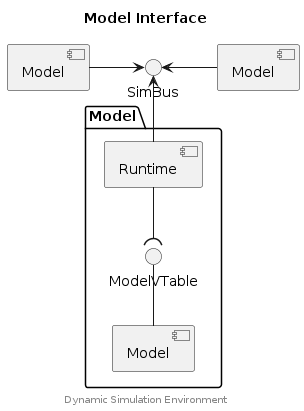

## Model API


The Model API allows model developers and integrators to implement models which
can be connected to a Simulation Bus.
Models are able to exchange signals with other models via this connection to
a Simulation Bus.
A runtime environment, such as the ModelC Runtime/Importer, will load the
model and also manages the connection with the Simulation Bus.

The Model API provides two simple interfaces which facilitate the development
of models; the Model Interface which is concerned with the model lifecycle; and
the Signal Interface which facilitates signal exchange.


### Model Interface


The Model Interface provides the necessary types, methods and objects required
for implementing a model. Such a model can easily participate in a simulation
by being connecting to a Simulation Bus (using the ModelC Importer) and then
exchanging signals with other models in that simulation by using the
provided SignalVector objects (which represent those signals).

Additionally, model implementers may extend or modify the Model Interface
to support more complex integrations.


### Signal Vector Interface


Models exchange signals via the Simulation Bus using a Signal Vector. Signal
Vectors represent a logical grouping of signals (e.g. a collection of signals
belonging to an ECU interface or bus). They are defined by a `SignalGroup`
schema kind and may be configured to represent either either scalar
(double, int, bool) or binary values.


### Component Diagram

<div hidden>

```
@startuml model-interface

skinparam nodesep 55
skinparam ranksep 40

title Model Interface

component "Model" as m1
component "Model" as m2
interface "SimBus" as SBif
m1 -left-> SBif
m2 -right-> SBif

package "Model" {
        component "Runtime" as ModelC
        interface "ModelVTable" as Mvt
        component "Model" as Mdl
}

SBif <-down- ModelC
Mdl -up- Mvt
Mvt )-up- ModelC

center footer Dynamic Simulation Environment

@enduml
```

</div>




### Example (Model Interface)





### Example (Signal Vector Interface)





## Typedefs

### ModelDesc

```c
typedef struct ModelDesc {
    ModelIndex index;
    SimulationSpec* sim;
    ModelInstanceSpec* mi;
    SignalVector* sv;
    ModelVTable vtable;
    uint64_t [2] __reserved__;
}
```

### ModelSignalIndex

```c
typedef struct ModelSignalIndex {
    SignalVector* sv;
    double* scalar;
    void** binary;
    uint32_t vector;
    uint32_t signal;
}
```

### ModelVTable

```c
typedef struct ModelVTable {
    ModelCreate create;
    ModelStep step;
    ModelDestroy destroy;
    ModelIndex index;
    void *[2] __reserved__;
}
```

### SignalVector

```c
typedef struct SignalVector {
    const char* name;
    const char* alias;
    const char* function_name;
    ModelInstanceSpec* mi;
    void* index;
    uint32_t count;
    const char** signal;
    _Bool is_binary;
    SignalVectorVTable vtable;
    uint64_t [9] __reserved__;
}
```

### SignalVectorVTable

```c
typedef struct SignalVectorVTable {
    BinarySignalAppendFunc append;
    BinarySignalResetFunc reset;
    BinarySignalReleaseFunc release;
    SignalAnnotationGetFunc annotation;
    BinarySignalCodecFunc codec;
    SignalGroupAnnotationGetFunc group_annotation;
    void *[2] __reserved__;
}
```

## Functions

### model_annotation

Retrieve the specified annotation from the Model specification.

#### Parameters

model (ModelDesc*)
: The Model Descriptor object representing an instance of this model.

name (const char*)
: The name of the annotation.

#### Returns

const char*
: The value of the specified annotation.

NULL
: The specified annotation was not found.


### model_create

> Optional method of `ModelVTable` interface.

Called by the Model Runtime to create a new instance of this model.

The `model_create()` method may extend or mutilate the provided Model
Descriptor. When extending the Model Descriptor _and_ allocating additional
resources then the `model_destroy()` method should also be implemented.

Fault conditions can be communicated to the caller by setting variable
`errno` to a non-zero value. Additionally, `log_fatal()` can be used to
immediately halt execution of a model.

#### Parameters

model (ModelDesc*)
: The Model Descriptor object representing an instance of this model.

#### Returns

NULL
: The Channel was configured.

(ModelDesc*)
: Pointer to a new, or mutilated, version of the Model Descriptor object. The
  original Model Descriptor object will be released by the Model Runtime (i.e.
  don't call `free()`).

errno <> 0 (indirect)
: Indicates an error condition.

#### Example





### model_destroy

> Optional method of `ModelVTable` interface.

Called by the Model Runtime at the end of a simulation, the `model_destroy()`
function may be implemented by a Model Integrator to perform any custom
cleanup operations (e.g. releasing instance related resources, such as open
files or allocated memory).

#### Parameters

model (ModelDesc*)
: The Model Descriptor object representing an instance of this model.


### model_index_

> Provided method (by the Runtime). Model implementers may specify
  a different index method by mutilating the Model Descriptor in the
  `model_create()` method, or even at runtime.

A model may use this method to index a signal that is contained within the
Signal Vectors of the Model Descriptor.

#### Parameters

model (ModelDesc*)
: The Model Descriptor object representing an instance of this model.

vname (const char*)
: The name (alias) of the Signal Vector.

sname (const char*)
: The name of the signal within the Signal Vector. When set to NULL the index
  will match on Signal Vector (vanme) only.

#### Returns

ModelSignalIndex
: An index. When valid, either the `scalar` or `binary` fields will be set to
  a valid pointer (i.e. not NULL). When `sname` is not specified the index will
  contain a valid pointer to a Signal Vector object only (i.e. both `scalar`
  and `binary` will be set to NULL).


### model_instance_annotation

Retrieve the specified annotation from the Model instance (Stack specification).

#### Parameters

model (ModelDesc*)
: The Model Descriptor object representing an instance of this model.

name (const char*)
: The name of the annotation.

#### Returns

const char*
: The value of the specified annotation.

NULL
: The specified annotation was not found.


### model_step

> Mandatory method of `ModelVTable` interface. Alternatively, Model implementers
  may specify the `ModelVTable.step` method dynamically by mutilating the
  Model Descriptor in the `model_create()` method, or even at runtime.

Called by the Model Runtime to step the model for a time interval.

#### Parameters

model (ModelDesc*)
: The Model Descriptor object representing an instance of this model.

model_time (double*)
: (in/out) Specifies the model time for this step of the model.

stop_time (double)
: Specifies the stop time for this step of the model. The model step should not
  exceed this time.

#### Returns

0
: The step completed without error.

<>0
: An error occurred at some point during the step execution.

model_time (via parameter)
: The final model time reached for this step. This value may be less than
  `stop_time` if a step decides to return early.


### signal_annotation

Get an annotation from a signal definition.

#### Parameters

sv (SignalVector*)
: The Signal Vector object containing the signal.

index (uint32_t)
: Index of the signal in the Signal Vector object.

name (const char*)
: The name of the annotation.

#### Returns

const char*
: The annotation value.

NULL
: The requested annotation was not found, inspect `errno` for additional
information..

#### Example (Annotation Specification)


```yaml
kind: SignalGroup
metadata:
  name: data
spec:
  signals:
    - signal: counter
      annotations:
        initial_value: 10
```

#### Example (Code Usage)





### signal_append

Append data to the end of the specified binary signal. The append method will
resize the buffers of the binary signal as required.

#### Parameters

sv (SignalVector*)
: The Signal Vector object containing the signal.

index (uint32_t)
: Index of the signal in the Signal Vector object.

data (void*)
: Address/pointer to the data which should be appended to the binary signal.

len (uint32_t)
: Length of the provided data buffer being appended.

#### Returns

0
: The operation completed without error.

-EINVAL (-22)
: Bad arguments.

-ENOSYS (-88)
: The called function is not available.

<>0
: Indicates an error condition. Inspect `errno` for additional information.


### signal_codec

Return a pointer to the Codec object associated with a binary signal.

Codec objects are created when a binary signal is specified with a `mime_type`
annotation.

#### Parameters

sv (SignalVector*)
: The Signal Vector object containing the signal.

index (uint32_t)
: Index of the signal in the Signal Vector object.

#### Returns

void*
: The Codec object associated with the binary signal.

NULL
: The binary signal does not have an associated Codec object, inspect `errno`
for additional information..

#### Example (Codec Specification)


```yaml
kind: SignalGroup
metadata:
  name: network
  labels:
    channel: network_vector
  annotations:
    vector_type: binary
spec:
  signals:
    - signal: can_bus
      annotations:
        mime_type: application/x-automotive-bus; interface=stream; type=frame;
bus=can; schema=fbs; bus_id=1; node_id=2; interface_id=3
```

#### Reference


[Network Codec
API](https://github.com/boschglobal/dse.standards/tree/main/dse/ncodec)


### signal_group_annotation

Get an annotation from a signal group.

#### Parameters

sv (SignalVector*)
: The Signal Vector object representing the signal group.

name (const char*)
: The name of the annotation.

#### Returns

const char*
: The annotation value.

NULL
: The requested annotation was not found, inspect `errno` for additional
information..


### signal_release

Release the resources allocated to a binary signal (e.g. free the buffer).

#### Parameters

sv (SignalVector*)
: The Signal Vector object containing the signal.

index (uint32_t)
: Index of the signal in the Signal Vector object.

#### Returns

0
: The operation completed without error.

-EINVAL (-22)
: Bad arguments.

-ENOSYS (-88)
: The called function is not available.

<>0
: Indicates an error condition. Inspect `errno` for additional information.


### signal_reset

Reset a binary signal (e.g. sets its buffer length to 0). The buffers of the
binary signal are not released (see `signal_release()`).

#### Parameters

sv (SignalVector*)
: The Signal Vector object containing the signal.

index (uint32_t)
: Index of the signal in the Signal Vector object.

#### Returns

0
: The operation completed without error.

-EINVAL (-22)
: Bad arguments.

-ENOSYS (-88)
: The called function is not available.

<>0
: Indicates an error condition. Inspect `errno` for additional information.


