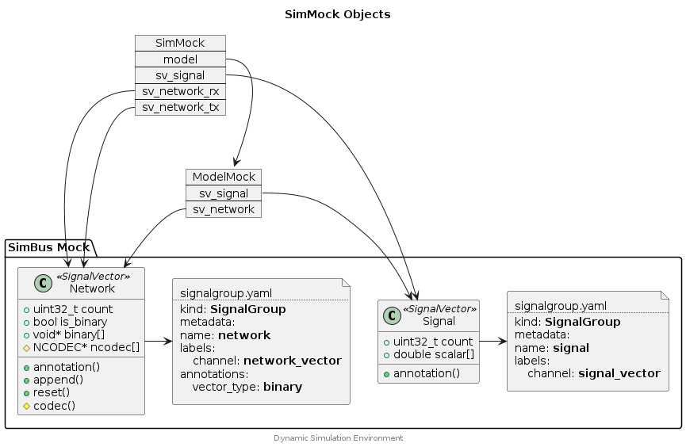

## SimMock API


The SimMock API provides interfaces for the development of CMocka Tests with
a representative mocked implementation of the ModelC <->  SimBus interface.
The mock supports a Signal Vector (scalar) and Network Vector (binary).
Several models may be loaded into the SimMock.


### Component Diagram

<div hidden>

```
@startuml simmock-objects

title SimMock Objects

package "SimBus Mock" {
    class Signal <<SignalVector>> {
        +uint32_t count
        +double scalar[]
        +annotation()
    }

    class Network <<SignalVector>> {
        +uint32_t count
        +bool is_binary
        +void* binary[]
        #NCODEC* ncodec[]
        +annotation()
        +append()
        +reset()
        #codec()
    }

    file svSig [
    signalgroup.yaml
    ....
    kind: <b>SignalGroup
    metadata:
    name: <b>signal
    labels:
        channel: <b>signal_vector
    ]

    file svNet [
    signalgroup.yaml
    ....
    kind: <b>SignalGroup
    metadata:
    name: <b>network
    labels:
        channel: <b>network_vector
    annotations:
        vector_type: <b>binary
    ]

    Signal -> svSig
    Network -> svNet
}

map ModelMock {
    sv_signal *--> Signal
    sv_network *--> Network
}

map SimMock {
    model *--> ModelMock

    sv_signal *--> Signal
    sv_network_rx *-> Network
    sv_network_tx *-> Network
}

center footer Dynamic Simulation Environment

@enduml
```

</div>




## Typedefs

### FrameCheck

```c
typedef struct FrameCheck {
    int frame_id;
    int offset;
    int value;
}
```

### ModelMock

```c
typedef struct ModelMock {
    const char * name;
    int * mi;
    int * sv_signal;
    int * sv_network;
    int * sv_save;
    int model_setup_func;
    int model_exit_func;
}
```

### SignalCheck

```c
typedef struct SignalCheck {
    int index;
    double value;
}
```

### SimMock

```c
typedef struct SimMock {
    int sim;
    double step_size;
    ModelMock * model;
    void * doc_list;
    double model_time;
    int * sv_signal;
    int * sv_network_rx;
    int * sv_network_tx;
}
```

## Functions

### simmock_alloc

Create a SimMock object.

#### Parameters

inst_names[] (const char*)
: Array of model instance names which should be allocated in the SimMock
  object.

count (size_t)
: The number of elements in the `inst_names` array.

#### Returns

SimMock*
: The allocated SimMock object. Caller should free by calling `simmock_free()`.


### simmock_configure

Configure a SimMock object with a list of command line arguments (as would be
used by the ModelC.exe).

#### Example




#### Parameters

mock (SimMock*)
: A SimMock object.

argv (char*)
: Array of arguments.

argc (size_t)
: Number of elements in the `argv` array.

expect_model_count (size_t)
: The expected number of models to be configured (based on the parsed
list of arguments).


### simmock_exit

Call `model_exit()` for each model.

#### Parameters

mock (SimMock*)
: A SimMock object.


### simmock_find_model

Find a MockModel object contained within a SimMock object.

#### Parameters

mock (SimMock*)
: A SimMock object.

name (const char*)
: The name of the model to find.

#### Returns

MockModel*
: The identified MockModel object.

NULL
: No MockModel was found.


### simmock_frame_check

Check the content of a binary signal for various frames. The binary signal
should be represented by a Network Codec (NCodec) object.

#### Example




#### Parameters

mock (SimMock*)
: A SimMock object.

model_name (const char*)
: The name of the model to check.

sig_name (const char*)
: The name of the binary signal where frames should be located.

checks (FrameCheck*)
: Array of FrameCheck objects.

count (size_t)
: The number elements in the checks array.


### simmock_free

Destroy and free resources allocated to a SimMock object.

#### Parameters

mock (SimMock*)
: The SimMock object to be released.


### simmock_load

Load all of the models referenced by a SimMock object.

#### Parameters

mock (SimMock*)
: A SimMock object.

expect_exit_function (bool)
: Indicate that model libraries should contain a `model_exit` function.


### simmock_print_network_frames

Print the frames contained in each network vector of each model.

#### Parameters

mock (SimMock*)
: A SimMock object.

level (int)
: The log level to print at.


### simmock_print_scalar_signals

Print the scalar signal values of each signal vector of each model.

#### Parameters

mock (SimMock*)
: A SimMock object.

level (int)
: The log level to print at.


### simmock_read_frame

Read a frame, using the associated NCodec object, from the specified
binary signal.

#### Parameters

sv (SignalVector*)
: A Signal Vector object.

sig_name (const char*)
: The name of the binary signal where frames should be written.

data (uint8_t*)
: Array for the read data. The data is preallocated by the caller.

len (size_t)
: Length of the data array.

#### Returns

uint32_t
: The Frame ID associated with the read data.

0
: No frame was found in the specified binary signal.


### simmock_setup

Calls the `model_setup()` function on each model and then creates Signal Vectors
for each model. Additional Signal Vectors are created to facilitate the
mocked behaviour of a simulation (via the SimMock object).

#### Parameters

mock (SimMock*)
: A SimMock object.

sig_name (const char*)
: The name of the scalar channel.

sig_name (const char*)
: The name of the binary channel.


### simmock_signal_check

Check the values of various signals on the Signal Vector (scalar).

#### Example




#### Parameters

mock (SimMock*)
: A SimMock object.

model_name (const char*)
: The name of the model to check.

checks (SignalCheck*)
: Array of SignalCheck objects.

count (size_t)
: The number elements in the checks array.

func (SignalCheckFunc)
: Optional function pointer for performing the signal check.


### simmock_step

Calls `model_step()` on each model and manages the mocked exchange of both
scalar and binary Signal Vectors.

#### Parameters

mock (SimMock*)
: A SimMock object.

assert_rc (bool)
: Indicate that an assert check (value 0) should be made for each return
  from a call to `model_step()`.

#### Returns

int
: The combined (or'ed) return code of each call to `model_step()`.


### simmock_write_frame

Write a frame, using the associated NCodec object, to the specified
binary signal.

#### Parameters

sv (SignalVector*)
: A Signal Vector object.

sig_name (const char*)
: The name of the binary signal where frames should be written.

data (uint8_t*)
: Array of data to write (in the frame).

len (size_t)
: Length of the data array.

frame_id (uint32_t)
: The Frame ID associated with the data.


