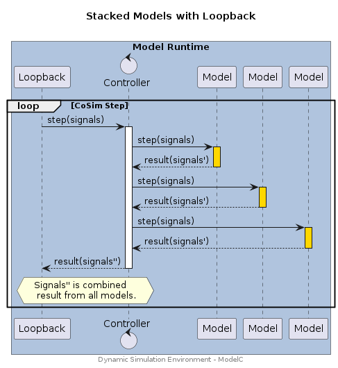
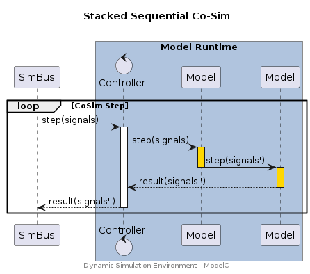
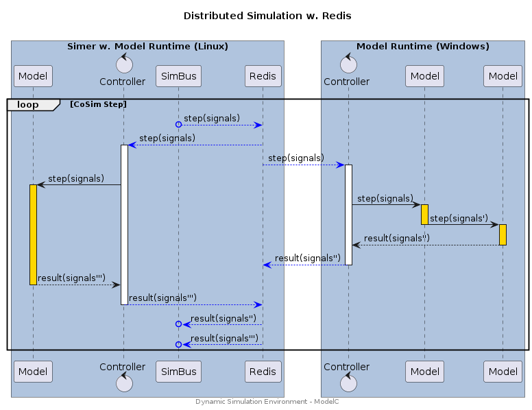

## Overview

The Dynamic Simulation Environment supports the construction of Distributed Simulation Topologies, as well as Single Process SImulation Topologies, using both the Simer and ModelC simulation runtimes. Additionally, the underlying messaging transport can also be implemented in any programming language or operating system.


## Stacked

Several Models are stacked in a single model runtime.


### Stacked w. Loopback

Characteristics:

* Single Process - Sequential execution of models within a single process using the **ModelC** model runtime. Performance limited by CPU clock speed.
* Co-Simulation - Phase shift for signal exchange between model steps (i.e. output to input). Phase shift is equal to one simulation step.
* Loopback SimBus - Low latency execution with no external/network signal exchange.
* Limited deployment - Use of Loopback SimBus means that only single process deployment is possible.

> Note: Models may be stacked in any deployment topology (i.e. with Redis).


#### Sequence Diagram

<div hidden>

```text
@startuml topology-stacked-loopback

title "Stacked Models with Loopback\n"

box "Model Runtime" #LightSteelBlue

participant Loopback as l
control Controller as c
participant Model as m1
participant Model as m2
participant Model as m3

loop CoSim Step
l -> c : step(signals)
activate c
c -> m1 : step(signals)
activate m1 #gold
return result(signals')
c -> m2 : step(signals)
activate m2 #gold
return result(signals')
c -> m3 : step(signals)
activate m3 #gold
return result(signals')
return result(signals'')
hnote over l,c : Signals'' is combined\n result from all models.

end

end box

center footer Dynamic Simulation Environment - ModelC

@enduml

```

</div>




#### Configuration

##### CLI / Environemnt

| Variable           | CLI Option (ModelC/Simer) | Value |
| ------------------ | ------------------------- | ------- |
| `SIMBUS_TRANSPORT` | `--transport` | `loopback` |
| `SIMBUS_URI`       | `--uri`       | `loopback` |


##### Simulation Stack

<details>
<summary>simulation.yaml</summary>

```yaml
---
kind: Stack
spec:
  connection:
    transport:
      loopback:
        uri: loopback
```
</details>


### Stacked Sequential Co-Sim

> Note: This is a future/planned development.

Characteristics:

* Single Process - Sequential execution of models within a single process using the **ModelC** model runtime. Performance limited by CPU clock speed.
* Co-Simulation - Sequential-Co-Simulation resulting in _no_ phase shift _between_ the stacked models.
* Limited deployment - Used to compose models from several "component" models where the resultant model does not exhibit phase shift between its input and output signals for any simulation step.


#### Sequence Diagram

<div hidden>

```text
@startuml topology-stacked-sequential

title "Stacked Sequential Co-Sim\n"


participant SimBus as s

box "Model Runtime" #LightSteelBlue

control Controller as c
participant Model as m1
participant Model as m2

loop CoSim Step
s -> c : step(signals)
activate c
c -> m1 : step(signals)
activate m1 #gold
m1 -> m2 : step(signals')
deactivate
activate m2 #gold
m2 --> c : result(signals'')
deactivate
return result(signals'')

end

end box

center footer Dynamic Simulation Environment - ModelC

@enduml
```

</div>




#### Configuration

_TBD_


## Distributed

Models are distributed in several instances of a model runtime. Model runtimes may run on several computers, use different operating systems, and execute in other Simulation Environments.


### Native w. Redis

Characteristics:

* Multi Process - Parallel execution of models using a **Simer/ModelC** model runtime. Performance limited by number of CPU Cores and Processing Nodes (e.g. VMs/Workstations).
* Co-Simulation - Phase shift for signal exchange between model steps (i.e. output to input). Phase shift is equal to one simulation step.
* Redis w. SimBus - Low latency signal exchange when running with a **Simer** deployment, medium latency when operating cross-platform simulation (latency depends on network performance).
* Flexible deployment - The **Simer** Container Runtime can be used for high performance, scaled, Linux deployments. The underlying model runtime **ModelC** is available for Windows deployments. Both can be combined to create distributed simulations.


#### Sequence Diagram

<div hidden>

```text
@startuml topology-distributed-redis

title "Distributed Simulation w. Redis\n"

box "Simer w. Model Runtime (Linux)" #LightSteelBlue
participant Model as m0
control Controller as c0

participant SimBus as s
participant Redis as r
end box

box "Model Runtime (Windows)" #LightSteelBlue
control Controller as c1
participant Model as m1
participant Model as m2
end box

loop CoSim Step

s o-[#Blue]-> r : step(signals)
r -[#Blue]-> c0 : step(signals)
activate c0
r -[#Blue]-> c1 : step(signals)
activate c1

c0 -> m0 : step(signals)
activate m0 #gold
c1 -> m1 : step(signals)

activate m1 #gold
m1 -> m2 : step(signals')
deactivate m1
activate m2 #gold
m2 --> c1 : result(signals'')
deactivate m2
c1 -[#Blue]-> r : result(signals'')
deactivate c1

m0 --> c0 : result(signals''')
deactivate m0
c0 -[#Blue]-> r : result(signals''')
deactivate c0
r -[#Blue]->o s : result(signals'')
r -[#Blue]->o s : result(signals''')


end

center footer Dynamic Simulation Environment - ModelC

@enduml

```

</div>




#### Configuration

##### CLI / Environment

| Variable           | CLI Option (ModelC/Simer) | Value |
| ------------------ | ------------------------- | ------- |
| `SIMBUS_TRANSPORT` | `--transport` | `redis` |
| `SIMBUS_URI`       | `--uri`       | `redis://localhost:6379` |

> Note: There are several variations of Redis transports, `redispubsub` being the most common (and original). The newer `redis` transport has the best performance and is suggested for new simulation projects.

##### Simulation Stack

<details>
<summary>simulation.yaml</summary>

```yaml
---
kind: Stack
spec:
  connection:
    transport:
      redis:
        uri: redis://localhost:6379
```
</details>


### Gateway

_TBD_


## Integrated

### MCL Models

_TBD_


### Embedded

_TBD_
