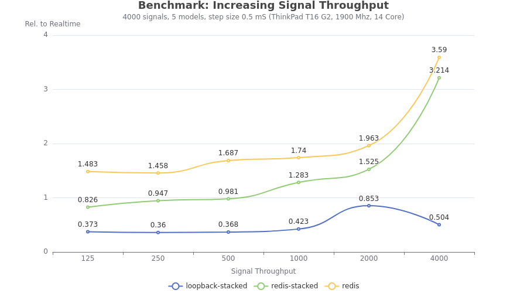
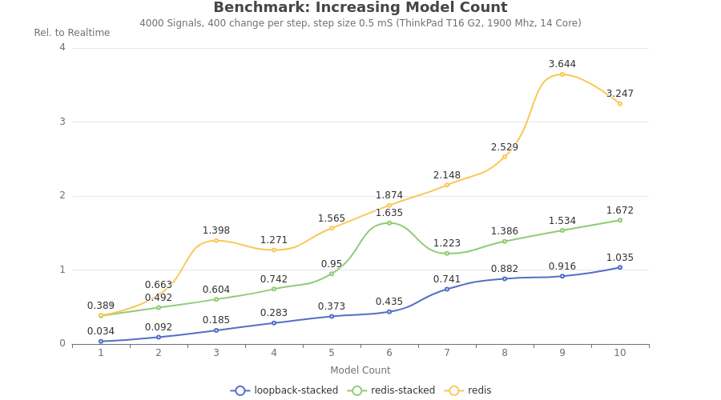

## Overview

The following Simulation Framework Benchmarks give an understanding of how the
Dynamic Simulation Environment performs for a variety of simulation topologies.
This information can be used to decide on a deployment strategy for a
simulation that takes into account:

* The total number of __signals__ in a simulation.
* How many __models__ are configured in a simulation.
* The expected amount of signal __exchange__ per simulation step (throughput).

Each of these benchmarks are evaluated across a subset of recommended
simulation topologies. These topologies include:

* __Model Runtime__ - Stacked model instance (single process) / Loopback SimBus
* __Stacked w. Redis__ - Stacked model instance (single process) / Redis SimBus
* __Distributed w. Redis__ - Distributed model instances (process per model) / Redis SimBus

All benchmark simulations are executed using the Simer docker appliance with
a Co-Simulation step size of 0.5mS. Each simulation runs for 1 "simulation"
minute (i.e. a total of 2000 simulation steps).

## Benchmark (Core i7-1370P)

Host system is a ThinkPad T16 G2 (Intel Core i7-1370P, 1900 Mhz, 14 Core, 32 GB Memory)
with Linux running in WSL2. All binaries are compiled for `amd64` architecture
with optimization `-03`. Values are presented relative to realtime operation.

### Signal Count

| Variable           | Value |
| ------------------ | ----- |
| `SIGNAL_COUNT`     | Increasing range (count = 1000 * 2^N for N=0,1,2,3,4,5) |
| `SIGNAL_CHANGE`    | Constant at 200 signals per simulation step, distributed evenly over all models |
| `MODEL_COUNT`      | Constant at 5 |

### Signal Throughput

| Variable           | Value |
| ------------------ | ----- |
| `SIGNAL_COUNT`     | Constant at 4000 |
| `SIGNAL_CHANGE`    | Increasing range (change per model = 25 50 100 200 400 800**), distributed evenly over all models |
| `MODEL_COUNT`      | Constant at 5 |

> Note: **Represents saturation with 4000 signal changes per simulation step.

### Model Count

| Variable           | Value |
| ------------------ | ----- |
| `SIGNAL_COUNT`     | Constant at 4000 |
| `SIGNAL_CHANGE`    | Constant at 400, distributed evenly over all models |
| `MODEL_COUNT`      | Increasing range (count = 1 2 3 4 6 8 12 16) |

## Benchmark (Codespace 4 vCPU)

Host system is a Codespace 4 core virtual machine. Reports CPU as Xeon Platinum 8370C
(Intel(R) Xeon(R) Platinum 8370C CPU, 2.80GHz, 4 Core, 16 GB Memory) with Linux.
All binaries are compiled for `amd64` architecture with optimization `-03`.
Values are presented relative to realtime operation.

### Signal Count

| Variable           | Value |
| ------------------ | ----- |
| `SIGNAL_COUNT`     | Increasing range (count = 1000 * 2^N for N=0,1,2,3,4,5) |
| `SIGNAL_CHANGE`    | Constant at 200 signals per simulation step, distributed evenly over all models |
| `MODEL_COUNT`      | Constant at 5 |

### Signal Throughput

| Variable           | Value |
| ------------------ | ----- |
| `SIGNAL_COUNT`     | Constant at 4000 |
| `SIGNAL_CHANGE`    | Increasing range (change per model = 25 50 100 200 400 800**), distributed evenly over all models |
| `MODEL_COUNT`      | Constant at 5 |

> Note: **Represents saturation with 4000 signal changes per simulation step.

### Model Count

| Variable           | Value |
| ------------------ | ----- |
| `SIGNAL_COUNT`     | Constant at 4000 |
| `SIGNAL_CHANGE`    | Constant at 400, distributed evenly over all models |
| `MODEL_COUNT`      | Increasing range (count = 1 2 3 4 ...) |

