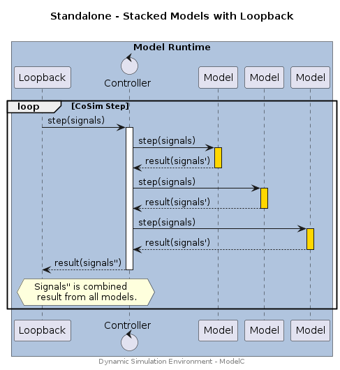
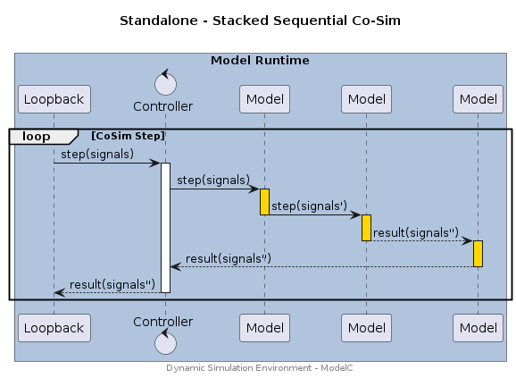
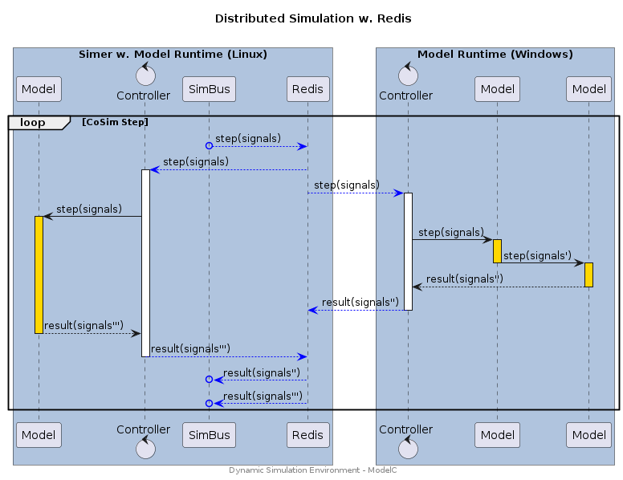
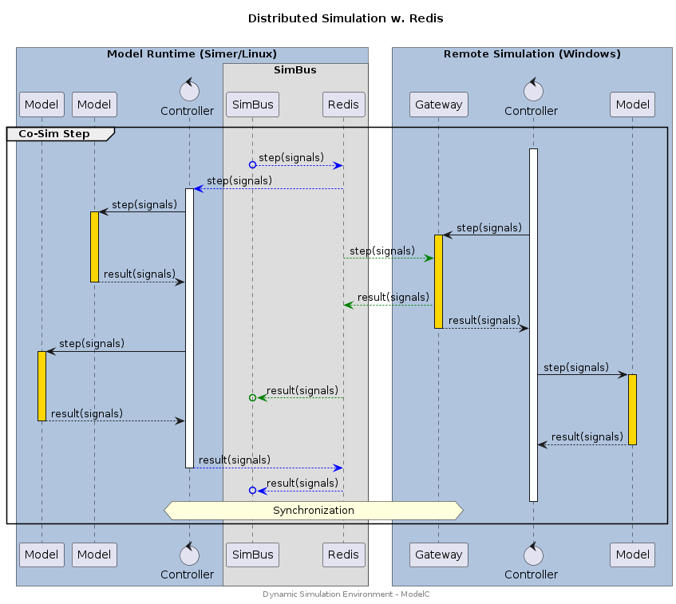

## Overview

The Dynamic Simulation Environment provides several simulation topologies, all
of which support distributed simulations, that may incorporate models running
on multiple OS/Arch combinations or running in multiple simulation environments.

These topologies include:

* __Standalone__ - Stacked model instances running in a single process. Uses a Loopback SimBus.
* __Distributed__ - Distributed model instances, multi process, multi OS, optionally stacked. Uses a Redis SimBus.
* __Gateway__ - Remote simulation systems are connected with a _gateway_ model. Uses a Redis SimBus.
* __MCL__ - Foreign models are imported via a Model Compatibility Library.
* __Realtime__ - Stacked model instances which may operate either Standalone or Distributed (i.e. Loopback or Redis based SimBus).
* __Embedded__ - External models and sensors and connected with a _POP_ model / TCP

These topologies are supported by the Simer docker appliance (Linux) and
ModelC runtime (Linux/Windows). The underlying messaging protocol used by the
Dynamic Simulation Environment is implemented with Flatbuffers and may be
implemented in any programming language or operating system.


## Standalone

Several Models are stacked in a single model runtime. For example, the runtime
may be packaged as an FMU using the FMI ModelC FMU wrapper.


### Stacked w. Loopback

Characteristics:

* Single Process - Sequential execution of models within a single process using the __ModelC__ model runtime. Performance limited by CPU clock speed.
* Co-Simulation - Phase shift for signal exchange between model steps (i.e. output to input). Phase shift is equal to one simulation step.
* Loopback SimBus - Low latency execution with no external/network signal exchange.
* Limited deployment - Use of Loopback SimBus means that only single process deployment is possible.

> Note: Models may be stacked in any deployment topology (i.e. with Redis).


#### Sequence Diagram

<div hidden>

```text
@startuml topology-standalone-stacked

title "Standalone - Stacked Models with Loopback\n"

box "Model Runtime" #LightSteelBlue

participant Loopback as l
control Controller as c
participant Model as m1
participant Model as m2
participant Model as m3

loop CoSim Step
l -> c : step(signals)
activate c
c -> m1 : step(signals)
activate m1 #gold
return result(signals')
c -> m2 : step(signals)
activate m2 #gold
return result(signals')
c -> m3 : step(signals)
activate m3 #gold
return result(signals')
return result(signals'')
hnote over l,c : Signals'' is combined\n result from all models.

end

end box

center footer Dynamic Simulation Environment - ModelC

@enduml

```

</div>




#### Configuration

##### CLI / Environment

| Variable           | CLI Option (ModelC/Simer) | Value |
| ------------------ | ------------------------- | ------- |
| `SIMBUS_TRANSPORT` | `--transport` | `loopback` |
| `SIMBUS_URI`       | `--uri`       | `loopback` |


##### Simulation Stack

<details>
<summary>simulation.yaml</summary>

```yaml
---
kind: Stack
spec:
  connection:
    transport:
      loopback:
        uri: loopback
  runtime:
    stacked: true
```
</details>


### Stacked Sequential Co-Sim

Characteristics:

* Single Process - Sequential execution of models within a single process using the __ModelC__ model runtime. Performance limited by CPU clock speed.
* Co-Simulation - Sequential Co-Simulation resulting in _no_ phase shift of scalar signals exchanged _between_ models in the stack.
* Limited deployment - Used to compose models from several "component" models where the resultant model does not exhibit phase shift between its input and output scalar signals for any simulation step.


#### Sequence Diagram

<div hidden>

```text
@startuml topology-standalone-sequential

title "Standalone - Stacked Sequential Co-Sim\n"

box "Model Runtime" #LightSteelBlue

participant Loopback as l
control Controller as c
participant Model as m1
participant Model as m2
participant Model as m3

loop CoSim Step
l -> c : step(signals)
activate c
c -> m1 : step(signals)
activate m1 #gold
m1 -> m2 : step(signals')
deactivate
activate m2 #gold
m2 --> m3 : result(signals'')
deactivate
activate m3 #gold
m3 --> c : result(signals'')
deactivate
return result(signals'')

end

end box

center footer Dynamic Simulation Environment - ModelC

@enduml
```

</div>




#### Configuration

##### CLI / Environment

| Variable           | CLI Option (ModelC/Simer) | Value |
| ------------------ | ------------------------- | ------- |
| `SIMBUS_TRANSPORT` | `--transport` | `loopback` |
| `SIMBUS_URI`       | `--uri`       | `loopback` |


##### Simulation Stack

<details>
<summary>simulation.yaml</summary>

```yaml
---
kind: Stack
spec:
  connection:
    transport:
      loopback:
        uri: loopback
  runtime:
    stacked: true
    sequential: true
```
</details>


## Distributed

Models are distributed in several instances of a model runtime. Model runtimes may run on several computers, use different operating systems, and execute in other Simulation Environments. Models can also be stacked, and those stacks can be configured to operate in Sequential Co-Sim mode.


### Distributed w. Redis

Characteristics:

* Multi Process - Parallel execution of models using a __Simer/ModelC__ model runtime. Performance limited by number of CPU Cores and Processing Nodes (e.g. VMs/Workstations).
* Co-Simulation - Phase shift for signal exchange between model steps (i.e. output to input). Phase shift is equal to one simulation step.
* Redis w. SimBus - Low latency signal exchange when running with a __Simer__ deployment, medium latency when operating cross-platform simulation (latency depends on network performance).
* Flexible deployment - The __Simer__ Container Runtime can be used for high performance, scaled, Linux deployments. The underlying model runtime __ModelC__ is available for Windows deployments. Both can be combined to create distributed simulations.


#### Sequence Diagram

<div hidden>

```text
@startuml topology-distributed-redis
!pragma teoz true

title "Distributed Simulation w. Redis\n"

box "Model Runtime (Simer/Linux)" #LightSteelBlue
participant Model as m0
control Controller as c0
box "SimBus"
participant SimBus as s
participant Redis as r
end box
end box

box "Model Runtime (Windows)" #LightSteelBlue
control Controller as c1
participant Model as m1
participant Model as m2
end box

group Co-Sim Step

s o-[#Blue]-> r : step(signals)
r -[#Blue]-> c0 : step(signals)
activate c0
r -[#Blue]-> c1 : step(signals)
activate c1

c0 -> m0 : step(signals)
activate m0 #gold

group Sequential Co-Sim
c1 -> m1 : step(signals)
activate m1 #gold
m1 -> m2 : step(signals')
deactivate m1
activate m2 #gold
m2 --> c1 : result(signals'')
deactivate m2
end

c1 -[#Blue]-> r : result(signals'')
deactivate c1

m0 --> c0 : result(signals''')
deactivate m0
c0 -[#Blue]-> r : result(signals''')
deactivate c0
r -[#Blue]->o s : result(signals'')
r -[#Blue]->o s : result(signals''')


end

center footer Dynamic Simulation Environment - ModelC

@enduml

```

</div>




#### Configuration

##### CLI / Environment

| Variable           | CLI Option (ModelC/Simer) | Value |
| ------------------ | ------------------------- | ------- |
| `SIMBUS_TRANSPORT` | `--transport` | `redis` |
| `SIMBUS_URI`       | `--uri`       | `redis://localhost:6379` |

> Note: There are several variations of Redis transports, `redispubsub` being the most common (and original). The newer `redis` transport has the best performance and is suggested for new simulation projects.

##### Simulation Stack

<details>
<summary>simulation.yaml</summary>

```yaml
---
kind: Stack
spec:
  connection:
    transport:
      redis:
        uri: redis://localhost:6379
```
</details>


## Gateway

Remote Simulations are connected to a DSE/Simer based Simulation using a
Gateway Model. The Gateway Model is implemented in the Remote Simulations
framework/environment which then connects to the DSE/Simer Simulation. The
connection may be established with either an existing integration (i.e. the
DSE ModelC Library), or a direct implementation of the underlying
DSE messaging protocols.


### ModelC based Gateway

#### Sequence Diagram

<div hidden>

```text
@startuml topology-gateway-modelc
!pragma teoz true

title "Distributed Simulation w. Redis\n"

box "Model Runtime (Simer/Linux)" #LightSteelBlue
participant Model as m1
participant Model as m2
control Controller as c0
box "SimBus"
participant SimBus as s
participant Redis as r
end box
end box

box "Remote Simulation (Windows)" #LightSteelBlue
participant Gateway as g1
control Controller as c1
participant Model as m3
end box

group Co-Sim Step

activate c1
s o-[#Blue]-> r : step(signals)
r -[#Blue]-> c0 : step(signals)
activate c0

c0 -> m2 : step(signals)
activate m2 #gold

c1 -> g1 : step(signals)
activate g1 #gold
r -[#Green]-> g1 : step(signals)

m2 --> c0 : result(signals)
deactivate m2

g1 -[#Green]-> r : result(signals)
g1 --> c1 : result(signals)
deactivate g1

c0 -> m1 : step(signals)
activate m1 #gold

c1 -> m3 : step(signals)
activate m3 #gold

r -[#Green]->o s : result(signals)


m1 --> c0 : result(signals)
deactivate m1

m3 --> c1 : result(signals)
deactivate m3


c0 -[#Blue]-> r : result(signals)
deactivate c0
r -[#Blue]->o s : result(signals)

deactivate c1

hnote over c0,g1 : Synchronization

end

center footer Dynamic Simulation Environment - ModelC

@enduml

```

</div>




## MCL

Foreign models are imported to a simulation using a Model Compatibility Library
which may be implemented for any model standard (e.g. FMI MCL).


## Realtime

A simulation is deployed in a realtime simulation environment (e.g. HIL) with
a combination of distributed and stacked model instances, using a Redis based
SimBus, to ensure consistent realtime operation.


## Embedded

External models, sensors and ECUs are connected via native protocols (e.g. TCP)
to a _Point-of-Presence_ model running within a Simer based simulation.
