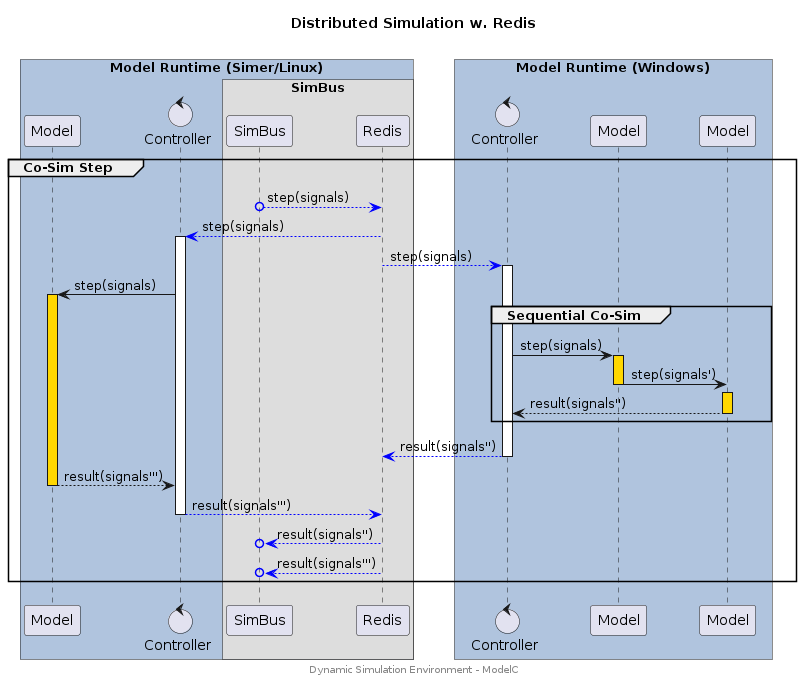

## Overview

The Dynamic Simulation Environment provides several simulation topologies, all
of which support distributed simulations, that may incorporate models running
on multiple OS/Arch combinations or running in multiple simulation environments.

These topologies include:

* __Model Runtime__ - Stacked model instance (single process) / Loopback SimBus
* __Stacked w. Redis__ - Stacked model instance (single process) / Redis SimBus
* __Distributed w. Redis__ - Distributed model instances (process per model) / Redis SimBus
* __Gateway__ - Remote simulation systems are connected with a _gateway_ model / Redis SimBus
* __MCL__ - Foreign models are imported via a Model Compatibility Library / Loopback SimBus
* __Realtime__ - Distributed and Stacked model instances / Loopback & Redis SimBus
* __Embedded__ - External models and sensors and connected with a _POP_ model / TCP

These topologies are supported by the Simer docker appliance (Linux) and
ModelC runtime (Linux/Windows). The underlying messaging protocol used by the
Dynamic Simulation Environment is implemented with Flatbuffers and may be
implemented in any programming language or operating system.


## Model Runtime

Several Models are stacked in a single model runtime. For example, the runtime
may be packaged as an FMU using the FMI ModelC FMU wrapper.


### Stacked w. Loopback

Characteristics:

* Single Process - Sequential execution of models within a single process using the __ModelC__ model runtime. Performance limited by CPU clock speed.
* Co-Simulation - Phase shift for signal exchange between model steps (i.e. output to input). Phase shift is equal to one simulation step.
* Loopback SimBus - Low latency execution with no external/network signal exchange.
* Limited deployment - Use of Loopback SimBus means that only single process deployment is possible.

> Note: Models may be stacked in any deployment topology (i.e. with Redis).


#### Sequence Diagram

<div hidden>

```text
@startuml topology-stacked-loopback

title "Stacked Models with Loopback\n"

box "Model Runtime" #LightSteelBlue

participant Loopback as l
control Controller as c
participant Model as m1
participant Model as m2
participant Model as m3

loop CoSim Step
l -> c : step(signals)
activate c
c -> m1 : step(signals)
activate m1 #gold
return result(signals')
c -> m2 : step(signals)
activate m2 #gold
return result(signals')
c -> m3 : step(signals)
activate m3 #gold
return result(signals')
return result(signals'')
hnote over l,c : Signals'' is combined\n result from all models.

end

end box

center footer Dynamic Simulation Environment - ModelC

@enduml

```

</div>


#### Configuration

##### CLI / Environemnt

| Variable           | CLI Option (ModelC/Simer) | Value |
| ------------------ | ------------------------- | ------- |
| `SIMBUS_TRANSPORT` | `--transport` | `loopback` |
| `SIMBUS_URI`       | `--uri`       | `loopback` |


##### Simulation Stack

<details>
<summary>simulation.yaml</summary>

```yaml
---
kind: Stack
spec:
  connection:
    transport:
      loopback:
        uri: loopback
```
</details>


### Stacked Sequential Co-Sim

> Note: This is a future/planned development.

Characteristics:

* Single Process - Sequential execution of models within a single process using the __ModelC__ model runtime. Performance limited by CPU clock speed.
* Co-Simulation - Sequential-Co-Simulation resulting in _no_ phase shift _between_ the stacked models.
* Limited deployment - Used to compose models from several "component" models where the resultant model does not exhibit phase shift between its input and output signals for any simulation step.


#### Sequence Diagram

<div hidden>

```text
@startuml topology-stacked-sequential

title "Stacked Sequential Co-Sim\n"


participant SimBus as s

box "Model Runtime" #LightSteelBlue

control Controller as c
participant Model as m1
participant Model as m2

loop CoSim Step
s -> c : step(signals)
activate c
c -> m1 : step(signals)
activate m1 #gold
m1 -> m2 : step(signals')
deactivate
activate m2 #gold
m2 --> c : result(signals'')
deactivate
return result(signals'')

end

end box

center footer Dynamic Simulation Environment - ModelC

@enduml
```

</div>


#### Configuration

_TBD_


## Stacked w. Redis

Several Models are stacked in a single model runtime and connect to a Redis
based SimBus.


## Distributed w. Redis

Models are distributed in several instances of a model runtime. Model runtimes may run on several computers, use different operating systems, and execute in other Simulation Environments.


### Native w. Redis

Characteristics:

* Multi Process - Parallel execution of models using a __Simer/ModelC__ model runtime. Performance limited by number of CPU Cores and Processing Nodes (e.g. VMs/Workstations).
* Co-Simulation - Phase shift for signal exchange between model steps (i.e. output to input). Phase shift is equal to one simulation step.
* Redis w. SimBus - Low latency signal exchange when running with a __Simer__ deployment, medium latency when operating cross-platform simulation (latency depends on network performance).
* Flexible deployment - The __Simer__ Container Runtime can be used for high performance, scaled, Linux deployments. The underlying model runtime __ModelC__ is available for Windows deployments. Both can be combined to create distributed simulations.


#### Sequence Diagram

<div hidden>

```text
@startuml topology-distributed-redis

title "Distributed Simulation w. Redis\n"

box "Simer w. Model Runtime (Linux)" #LightSteelBlue
participant Model as m0
control Controller as c0

participant SimBus as s
participant Redis as r
end box

box "Model Runtime (Windows)" #LightSteelBlue
control Controller as c1
participant Model as m1
participant Model as m2
end box

loop CoSim Step

s o-[#Blue]-> r : step(signals)
r -[#Blue]-> c0 : step(signals)
activate c0
r -[#Blue]-> c1 : step(signals)
activate c1

c0 -> m0 : step(signals)
activate m0 #gold
c1 -> m1 : step(signals)

activate m1 #gold
m1 -> m2 : step(signals')
deactivate m1
activate m2 #gold
m2 --> c1 : result(signals'')
deactivate m2
c1 -[#Blue]-> r : result(signals'')
deactivate c1

m0 --> c0 : result(signals''')
deactivate m0
c0 -[#Blue]-> r : result(signals''')
deactivate c0
r -[#Blue]->o s : result(signals'')
r -[#Blue]->o s : result(signals''')


end

center footer Dynamic Simulation Environment - ModelC

@enduml

```

</div>




#### Configuration

##### CLI / Environment

| Variable           | CLI Option (ModelC/Simer) | Value |
| ------------------ | ------------------------- | ------- |
| `SIMBUS_TRANSPORT` | `--transport` | `redis` |
| `SIMBUS_URI`       | `--uri`       | `redis://localhost:6379` |

> Note: There are several variations of Redis transports, `redispubsub` being the most common (and original). The newer `redis` transport has the best performance and is suggested for new simulation projects.

##### Simulation Stack

<details>
<summary>simulation.yaml</summary>

```yaml
---
kind: Stack
spec:
  connection:
    transport:
      redis:
        uri: redis://localhost:6379
```
</details>


## Gateway

Remote systems are connected to a simulation using a Gateway model. The Gateway
model is implemented in the remote systems operating framework and may use
either existing integrations (i.e. the ModelC Library) or a direct implementation
of the Flatbuffer based DSE messaging protocol.


## MCL

Foreign models are imported to a simulation using a Model Compatibility Library
which may be implemented for any model standard (e.g. FMI MCL).


## Realtime

A simulation is deployed in a realtime simulation environment (e.g. HIL) with
a combination of distributed and stacked model instances, using a Redis based
SimBus, to ensure consistent realtime operation.


## Embedded

External models, sensors and ECUs are connected via native protocols (e.g. TCP)
to a _Point-of-Presence_ model running within a Simer based simulation.
