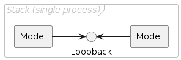
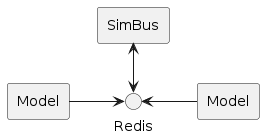
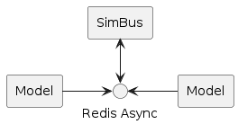
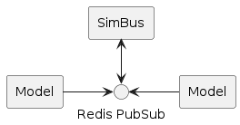

## Overview

A Simulation Transport specifies how data-exchange between Models is facilitated by a simulation
environment. Each transport has its own specific properties and the selection of
a transport will be determined by the planned operational deployment of a simulation.


| Transport    | Latency | Status |
| ------------ | ------- | ------ |
| Loopback     | Fastest | Available, stacked simulations (single process). |
| TCP          | Fastest | Planned. |
| **Redis**    | Faster  | **Recommended.** |
| Redis PubSub | Fast    | Available, stable. |
| RESP         | Fast    | Under consideration, for cloud connectivity (tunnelling).  |
| gPPC         | Fast    | Under consideration, for cloud connectivity (HTTP). |
| Redis Async  | Slower  | Available, experimental. |


### Usage

A simulation transport can be specified in a number of ways, however typically a transport will
be configured in a Stack Configuration (YAML) or via an Environment Variable.


### Stack Configuration

#### Example Simulation Stack

<details>
<summary>simulation.yaml</summary>

```yaml
---
kind: Stack
metadata:
  name: example
spec:
  connection:
    transport:
      redis:
        uri: redis://localhost:6379
        timeout: 60
```
</details>


### Environment Variables

| Variable           | CLI Option (ModelC/Simer) | Default |
| ------------------ | ------------------------- | ------- |
| `SIMBUS_TRANSPORT` | `--transport` | `redispubsub` |
| `SIMBUS_URI`       | `--uri`       | `redis://localhost:6379` |
| _N/A_              | `--timeout`   | `60` (seconds) |

> Note: Simer parameters have only a single `-` prefix (i.e. `-transport`). Environment variables can be specified with the `-env` parameter.


## Transports

### Loopback

<div hidden>

```text
@startuml transport-loopback
skinparam nodesep 55
skinparam ranksep 40
skinparam componentStyle rectangle
skinparam FrameBorderColor #c0c0c0
skinparam FrameFontColor #c0c0c0
skinparam FrameFontStyle italic

frame "Stack (single process)" {
    component "Model" as m1
    component "Model" as m2
    interface "Loopback" as SBif
    m1 -left-> SBif
    m2 -right-> SBif
}
@enduml
```

</div>




The `loopback` transport implements a limited SimBus algorithm which makes it possible to
run a model, or a stack of models, without connecting to a SimBus. Because the messaging
associated with connecting to a SimBus is removed (or internalised) by the loopback, _this_
is the fastest transport available when building simulations, however it is only
suitable for particular deployment scenarios and when developing models.

> Note: The loopback transport is only suitable for stacked simulations (i.e. models are arranged within single process).

#### Configuration Parameters

| Parameter           | Example |
| ------------------- | ------- |
| `transport` (name)  | `loopback` |
| `uri`               | `loopback` |
| `timeout` (seconds) | `60` |


### Redis

<div hidden>

```text
@startuml transport-redis
skinparam nodesep 55
skinparam ranksep 40
skinparam componentStyle rectangle

component "Model" as m1
component "Model" as m2
component "SimBus" as sb
interface "Redis" as red
m1 -left-> red
m2 -right-> red
sb <-down-> red

@enduml
```

</div>




The `redis` transport is recommended for connecting models in a simulation. It uses blocking
Redis commands and simple data types to implement a message exchange mechanism.

#### Configuration Parameters

| Parameter           | Example |
| ------------------- | ------- |
| `transport` (name)  | `redis` |
| `uri`               | `redis://localhost:6379` |
| `timeout` (seconds) | `60` |


### Redis Async

<div hidden>

```text
@startuml transport-redisasync
skinparam nodesep 55
skinparam ranksep 40
skinparam componentStyle rectangle

component "Model" as m1
component "Model" as m2
component "SimBus" as sb
interface "Redis Async" as red
m1 -left-> red
m2 -right-> red
sb <-down-> red

@enduml
```

</div>




An experimental transport which uses and asynchronous Redis library. The performance was
slower than expected; its still fast, however the `redis` transport is faster; and development has stopped.

#### Configuration Parameters

| Parameter           | Example |
| ------------------- | ------- |
| `transport` (name)  | `redis` |
| `uri`               | `redisasync://localhost:6379` |
| `timeout` (seconds) | `60` |


### Redis PUB/SUB

<div hidden>

```text
@startuml transport-redispubsub
skinparam nodesep 55
skinparam ranksep 40
skinparam componentStyle rectangle

component "Model" as m1
component "Model" as m2
component "SimBus" as sb
interface "Redis PubSub" as red
m1 -left-> red
m2 -right-> red
sb <-down-> red

@enduml
```

</div>




The `redispubsub` transport is the original, and reference, implementaion. Migration to the
newer `redis` transport is recommended.

> Note: In some deployment scenarios, particularly clould environments, the `redispubsub` transport might not work. In such cases the newer `redis` transport will operate correctly.

#### Configuration Parameters

| Parameter           | Example |
| ------------------- | ------- |
| `transport` (name)  | `redispubsub` |
| `uri`               | `redis://localhost:6379` |
| `timeout` (seconds) | `60` |
