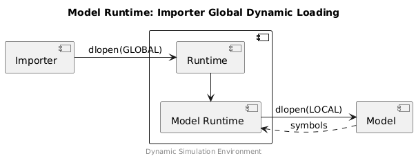

<!--
Copyright 2024 Robert Bosch GmbH

SPDX-License-Identifier: Apache-2.0
-->

# Model Runtime Example

The example implementation of a Model Runtime includes:

* __Importer__ - implements a simple importer for the ModelC (model.h) interface.
* __Runtime__ - an implementation of the importer interface which calls the
  ModelC Model Runtime (runtime.h).
* __Simulation__ - single model simulation (Simer style layout).


## Project Structure

```text
L- dse/modelc           Model C Library source code.
  L- model.h            Model interface.
  L- runtime.h          Runtime interface.
  L- controller
    L- model_runtime.c  Model Runtime implementation.
  L- examples/runtime
    L- importer.c       Example importer (implements model.h).
    L- runtime.c        Example importer/runtime model.
    L- sim              Example simulation with Simer style layout.
      L- model.c        Example ModelC model.
```


## Run the Example

```bash
# Clone and build the project:
$ git clone https://github.com/boschglobal/dse.modelc.git
$ cd dse.modelc
$ make

# Run the example:
$ dse/modelc/build/_out/examples/runtime/bin/importer \
    dse/modelc/build/_out/examples/runtime/lib/libruntime.so \
    dse/modelc/build/_out/examples/runtime/sim \
    data/simulation.yaml \
    target_inst
Importer: Cwd: /mnt/c/Users/rut6abt/Desktop/git/working/dse.modelc
Importer: Runtime: dse/modelc/build/_out/examples/runtime/lib/libruntime.so
Importer: Simulation Path: dse/modelc/build/_out/examples/runtime/sim
Importer: Simulation YAML: data/simulation.yaml
Importer: Model: target_inst
Importer: Loading runtime model: dse/modelc/build/_out/examples/runtime/lib/libruntime.so ...
Importer: vtable.create: 0x7f270f14fc10
Importer: vtable.step: 0x7f270f14fc30
Importer: vtable.destroy: 0x7f270f14fc40
Importer: Calling vtable.create() ...
Runtime: Version: 0.0.1
Runtime: Platform: linux-amd64
Runtime: Time: 2024-06-10 12:36:11 (UTC)
Runtime: Host: ABTZ0NKR
Runtime: CWD: /mnt/c/Users/rut6abt/Desktop/git/working/dse.modelc
Runtime: Simulation Path: dse/modelc/build/_out/examples/runtime/sim
Runtime: Simulation YAML: dse/modelc/build/_out/examples/runtime/sim/data/simulation.yaml
Runtime: Model: target_inst
Load YAML File: dse/modelc/build/_out/examples/runtime/sim/data/simulation.yaml
Load YAML File: dse/modelc/build/_out/examples/runtime/sim/data/model.yaml
...
```


## Linking Strategy

### Importer using Global Dynamic Loading

In this scenario the Importer loads the Runtime using `dlopen()` with
the `RTLD_GLOBAL` flag. This imports the symbols contained in the Model Runtime
and makes those symbols available to subsequently loaded Models. The Models
therefore depend on symbols provided by the Runtime.



> Note: the Importer and Runtime may be located in the same compilation unit.


### Importer using Local Dynamic Loading

In this scenario the Model is loaded using `dlopen()` with flags `RTLD_LAZY`
and `RTLD_LOCAL`. The Model then takes care to load the Model Runtime itself
(the path to use will be provided from the Importer/Runtime, or hardcoded).


> Note: this method has not been proven.


## Developer

```bash
# Use GDB:
$ gdb -q -ex='set confirm on' -ex=run -ex=quit --args \
    dse/modelc/build/_out/examples/runtime/bin/importer \
    dse/modelc/build/_out/examples/runtime/lib/libruntime.so \
    dse/modelc/build/_out/examples/runtime/sim \
    data/simulation.yaml \
    target_inst

# Use Valgrind:
$ valgrind -q --leak-check=yes \
    dse/modelc/build/_out/examples/runtime/bin/importer \
    dse/modelc/build/_out/examples/runtime/lib/libruntime.so \
    dse/modelc/build/_out/examples/runtime/sim \
    data/simulation.yaml \
    target_inst
```